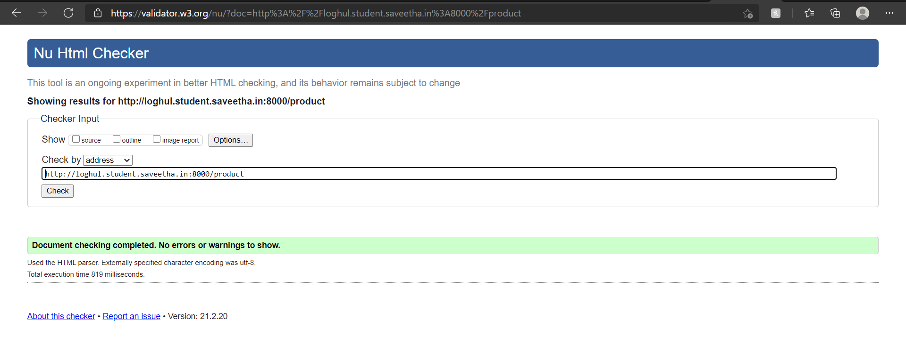

# Dynamic Website Design for a Manufacturing Company
## AIM:
To design a dynamic website for a chip manufacturing company.

## DESIGN STEPS:
### Step 1: 
Requirement collection.
### Step 2:
Creating the layout using HTML and CSS.
### Step 3:
Updating the sample content.
### Step 4:
Choose the appropriate style and color scheme.
### Step 5:
Validate the layout in various browsers.
### Step 6:
Validate the HTML code.
### Step 7:
Create a database model and migrate the database.
### Step 8:
Retrieve data from database and display it in a dynamic webpage.
### Step 9:
Publish the website in the given URL.

## PROGRAM:

### base.html:
```

<!DOCTYPE html>
<html lang="en">

<head>
    <title>Loghul Private Limited</title>
    <link rel="stylesheet" href="">
    <link rel = "icon" href ="" type = "image/x-icon"> 
              
</head>

<body>
    <div class="container">
    <div class="banner">
        Loghul Private Limited
    </div>
    <div class="menu">
        <div class="menuitem"><a href="/home">Home</a></div> 
        <div class="menuitem"><a href="/product">Products</a></div> 
        <div class="menuitem"><a href="/people">People</a></div>
        <div class="menuitem"><a href="/contact">Contact Us</a></div> 
    </div><div class="content">
        
    
    </div>
    <div class="footer">
        Copyright © 2021 Loghul Private Limited, Developed by Loghul.
    </div>
    </div>
</body>

</html>
```

### home.html:
```



    <div class="homecontent">    
    <h1>About Us</h1>
    
    <div class="contenttext">
    Loghul Pvt Ltd, provides a broad range of semiconductor and infrastructure software applications that serve the data center, networking, software, broadband, wireless, and storage and industrial markets. Common applications for its products include: data center networking, home connectivity, broadband access, telecommunications equipment, smartphones, base stations, data center servers and storage, factory automation, power generation and alternative energy systems, displays, and mainframe operations and management, and application software development. Some of Silicon's core technologies and products include:
    <ul>
        <li>Memory Chips</li>
        <li>SATA HDD</li>
        <li>SATA SSD </li>
        <li>Broadband Modems</li>
        <li>Wifi Devices</li>
        <li>Switching Devices</li>
        <li>Optical Sensors</li>
    </ul> 
    </div>
    </div>

```

### people.html:
```



    <h1 id="Ex">Executives</h1>
        <div class="row">
        
            <div class="column">
                
                <div class="membername">Name:{{ people.Membername }}</div>
                <div class="designation">Designation:{{ people.Designation }}</div>
            </div>
            
        </div>

```

### product.html:
```



<div class="productcontent">    
    <h1 style="text-align:center;"><u>Our Premium Products</u></h1>
    <div class="productitems">
    
        <div class="productitem"> 
            <div class="itemimage">
            
            </div>
            <div class="Itemname">Name:{{ product.Itemname }}</div>
            <div class="Product price">Price:{{ product.Price }}</div>
        </div>
    
    </div>
</div>

```

### contact.html:
```



<P class="free">

</P>
<div class="contain">
    <div class="text">
        <h1>+044 40405667/50504667</h1>
    </div>
</div>
<div class="contain">
    <div class="text">
        <h1>Loghulpvt.ltd@gmail.com</h1>
    </div>
</div>    
<div class="contain">
    <div class="text">
        <h1>New york City, 145,Redmond,Washington, United States</h1>
    </div>
</div>

    
```

### admin.py
```
from django.contrib import admin
from .models import Product,ProductAdmin
from .models import People,PeopleAdmin
# Register your models here.
admin.site.register(Product,ProductAdmin)

admin.site.register(People,PeopleAdmin)
```
### models.py
```
from django.db import models
from django.contrib import admin

# Create your models here.
class Product(models.Model):
    Itemname = models.CharField(max_length=100)
    Price = models.IntegerField()
    photo = models.ImageField(upload_to='photos/')
class ProductAdmin(admin.ModelAdmin):
    list_display = ('Itemname','Price','photo')

class People(models.Model):
    Membername = models.CharField(max_length=100)
    Designation = models.CharField(max_length=500)
    photo = models.ImageField(upload_to='photos/')

class PeopleAdmin(admin.ModelAdmin) :
    list_display = ('Membername','Designation', 'photo')
```

## OUTPUT:


### ADMIN PAGE:


## CODE VALIDAOR:





## RESULT:
Thus a website is designed for the manufacturing company and is hosted in the URL http://loghul.student.saveetha.in:8000/.